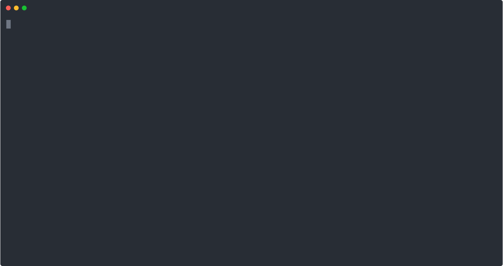

# silero-vad-realtime-minimum

> This example adds realtime microphone input and resampling from input device to target Silero VAD sample size on top of how `apps/silero-vad` was implemented.
>
> So consider this is a more advanced and feature rich version of the `silero-vad` example.
>
> For more advanced version with state management and threshold control of both silent and speaking duration, see [apps/silero-vad-realtime](https://github.com/proj-airi/candle-examples/tree/main/apps/silero-vad-realtime).



## Getting started

```
git clone https://github.com/proj-airi/candle-examples.git
cd apps/silero-vad-realtime-minimum
```

## Build

```
cargo fetch --locked
cargo clean
```

### NVIDIA CUDA

```
cargo build --package silero-vad-realtime-minimum
```

### macOS

```
cargo build --package silero-vad-realtime-minimum
```

## Acknowledgements

- [candle/candle-examples/examples/silero-vad](https://github.com/huggingface/candle/tree/main/candle-examples/examples/silero-vad)
